# Flowchart & System Flow
## SaaS Agentic Interior ERP — Dekoria Living

**Version:** v1.1  
**Last updated:** 2026-05-06  
**Status:** Updated after recent technical direction changes

Dokumen ini berisi kumpulan flow penting untuk pengembangan sistem ERP/internal system Dekoria Living. Flow ini menjadi bridge antara PRD, MVP System Blueprint, database schema, wireframe, technical architecture, API structure, dan sprint development.

---

## 0. Recent Update Summary

Update terbaru yang sudah dimasukkan ke flow ini:

```txt
1. Backend database diarahkan ke NeonDB / PostgreSQL, bukan Supabase.
2. File/image storage diarahkan ke ImageKit untuk render, DED, foto progress, dan asset konten.
3. AI agent layer menggunakan Mastra sebagai agent framework/orchestrator.
4. Model utama AI menggunakan Gemini 3 Flash dengan reasoning cukup tinggi.
5. Fallback AI menggunakan Gemini 3 Flash dengan reasoning lebih rendah untuk task ringan/hemat resource.
6. Flow AI dipisahkan antara summary, alert detection, project health, dan content opportunity.
7. Flow upload asset sekarang melewati ImageKit, lalu metadata disimpan ke NeonDB.
8. Flow development disesuaikan dengan MVP System Blueprint dan agentic architecture.
```

---

## 1. Updated High-Level Architecture Flow

Flow arsitektur terbaru setelah perubahan ke NeonDB, ImageKit, Mastra, dan Gemini.

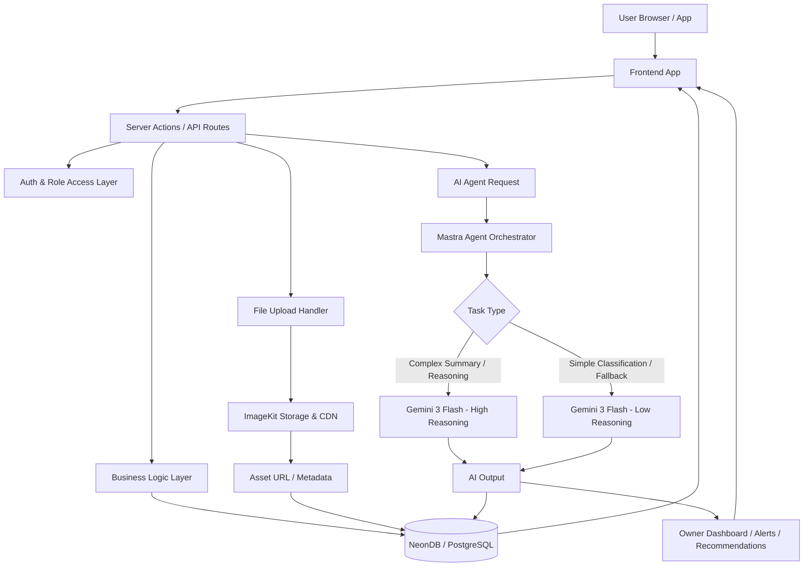

### Architecture Notes

```txt
Frontend App       = UI dashboard untuk owner dan team.
API Routes         = Gateway untuk CRUD, upload, AI request, dan role access.
NeonDB             = Primary relational database.
ImageKit           = Storage/CDN untuk gambar, render, DED, dan content assets.
Mastra             = AI agent framework untuk orchestration.
Gemini 3 Flash     = Main AI model untuk summary, classification, recommendation.
```

---

## 2. Overall System Flow

Flow besar sistem dari user login, masuk ke workspace berdasarkan role, menginput data, lalu data tersebut diproses menjadi insight untuk owner.

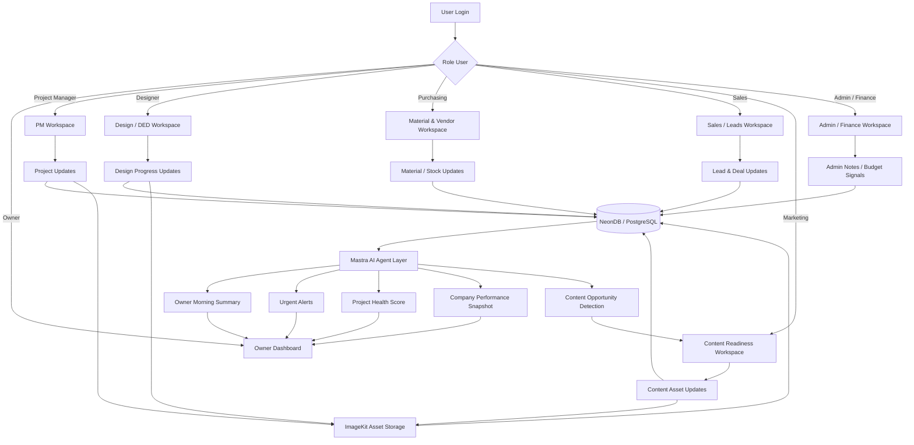

### Purpose

Sistem menjadi satu pusat informasi operasional perusahaan. Semua update dari PM, designer, purchasing, sales, marketing, dan admin masuk ke database utama, asset visual masuk ke ImageKit, lalu Mastra agent membaca konteks dari NeonDB untuk menghasilkan summary, alert, health score, dan rekomendasi action.

---

## 3. Role-Based User Flow

Flow ini menjelaskan aktivitas utama tiap role di dalam sistem.

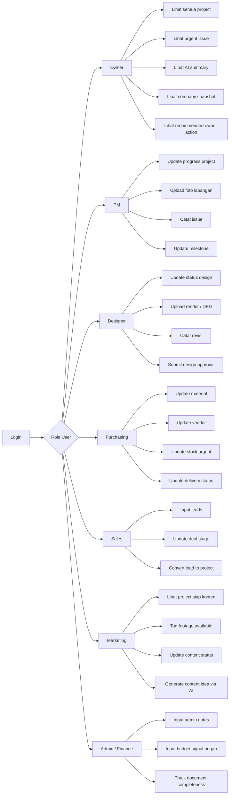

### Role Summary

| Role | Main Responsibility |
|---|---|
| Owner | Melihat kondisi perusahaan, project, issue, sales, material, AI summary, dan recommended action |
| PM | Update progress harian, issue lapangan, milestone project, dan foto progress |
| Designer | Update status design, render, revisi, DED, approval, dan upload file visual |
| Purchasing | Update material, vendor, stok, PO, dan delivery |
| Sales | Input leads, update deal stage, convert lead menjadi project |
| Marketing | Melihat project siap konten, tagging asset, dan membuat content plan |
| Admin / Finance | Menginput data administratif dan budget signal ringan untuk MVP |

---

## 4. Project Lifecycle Flow

Flow utama perjalanan project dari lead sampai selesai dan siap dijadikan portfolio/content.

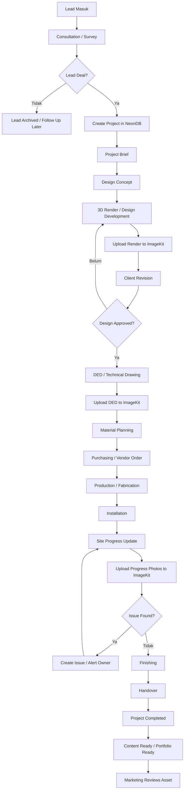

### Recommended Project Status Enum

```txt
Lead
Survey
Design Concept
Design Revision
Design Approved
DED
Material Planning
Purchasing
Production
Installation
Finishing
Handover
Completed
Content Ready
Archived
```

---

## 5. Daily Project Update Flow

Flow untuk PM melakukan update progress harian.

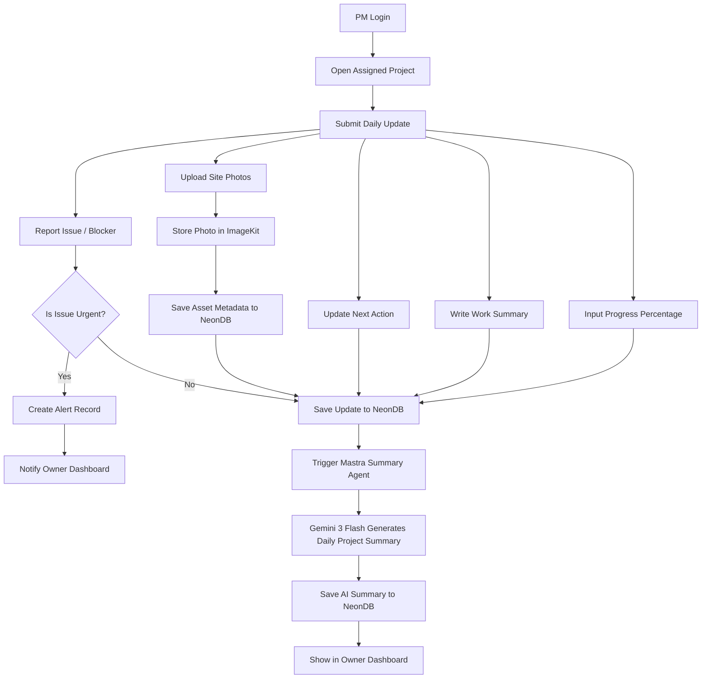

### Daily Update Fields

```txt
project_id
updated_by
date
progress_percentage
work_summary
issue_status
issue_description
photos_asset_ids
next_action
ai_summary_id
created_at
updated_at
```

---

## 6. Asset Upload & Storage Flow

Flow baru untuk semua file visual: render, DED, progress photo, handover photo, dan content footage thumbnail.

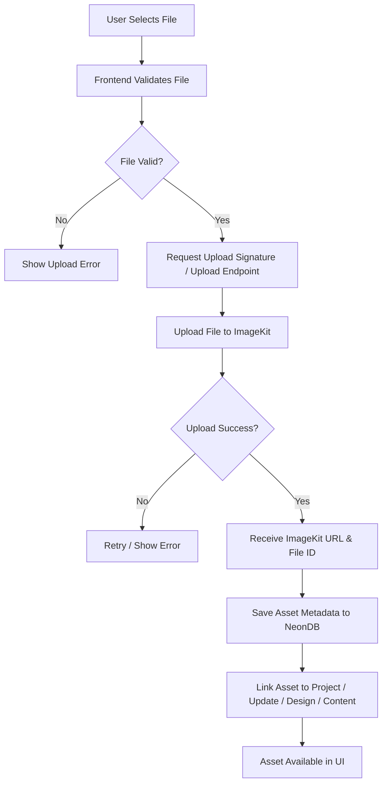

### Asset Metadata Fields

```txt
id
project_id
related_entity_type
related_entity_id
asset_type
file_name
file_url
imagekit_file_id
mime_type
file_size
uploaded_by
created_at
```

### Asset Type Enum

```txt
3d_render
ded_file
site_photo
progress_photo
handover_photo
before_photo
after_photo
content_footage
content_thumbnail
material_reference
client_document
```

---

## 7. Owner Morning Dashboard Flow

Flow ketika owner membuka dashboard setiap pagi.

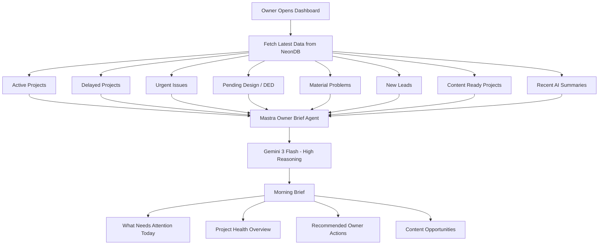

### Example AI Morning Brief

```txt
Hari ini ada 3 project yang butuh perhatian.

1. Project A mengalami delay karena material belum datang.
2. Project B sudah masuk tahap finishing dan siap difoto untuk konten.
3. Project C masih menunggu approval DED dari client.

Rekomendasi:
- Follow up purchasing untuk material Project A.
- Jadwalkan shooting Project B.
- Minta designer follow up approval Project C.
```

---

## 8. Design / DED Flow

Flow kerja designer dari membaca brief sampai DED selesai.

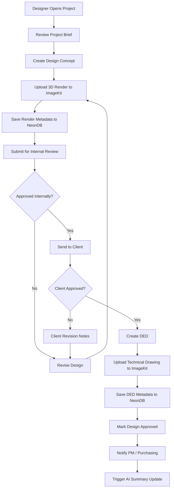

### Recommended Design Status Enum

```txt
Not Started
Concepting
3D Render In Progress
Internal Review
Client Review
Revision
Approved
DED In Progress
DED Completed
```

---

## 9. Material / Purchasing Flow

Flow purchasing dari material list sampai material siap produksi atau instalasi.

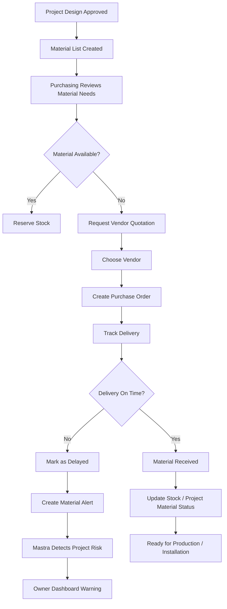

### Recommended Material Status Enum

```txt
Needed
Checking Stock
Available
Need Purchase
PO Created
Waiting Delivery
Delayed
Received
Installed
Cancelled
```

---

## 10. Sales to Project Flow

Flow dari lead masuk sampai menjadi project aktif.

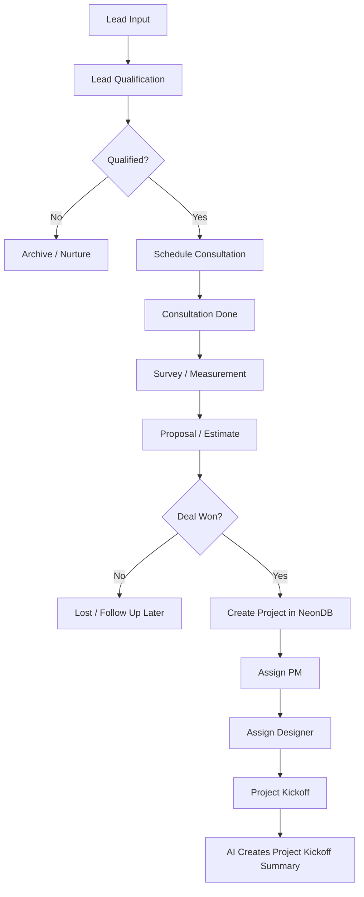

### Recommended Sales Stage Enum

```txt
New Lead
Hot
Contacted
Consultation Scheduled
Consultation Done
Survey Scheduled
Survey Done
Proposal Sent
Negotiation
Won
Lost
Converted to Project
```

---

## 11. Content Readiness Flow

Flow untuk melihat project mana yang sudah bisa dijadikan konten marketing.

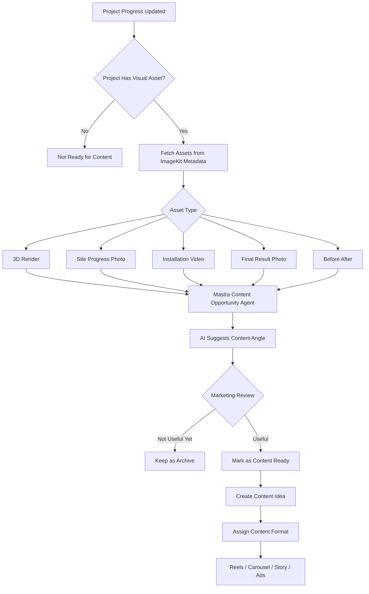

### Recommended Content Status Enum

```txt
No Asset
Raw Asset Available
Need Review
Content Ready
Script Needed
Editing
Scheduled
Published
Used for Ads
Archived
```

---

## 12. AI Agent Flow - Mastra + Gemini

Flow bagaimana Mastra mengatur AI task dan memilih reasoning mode.

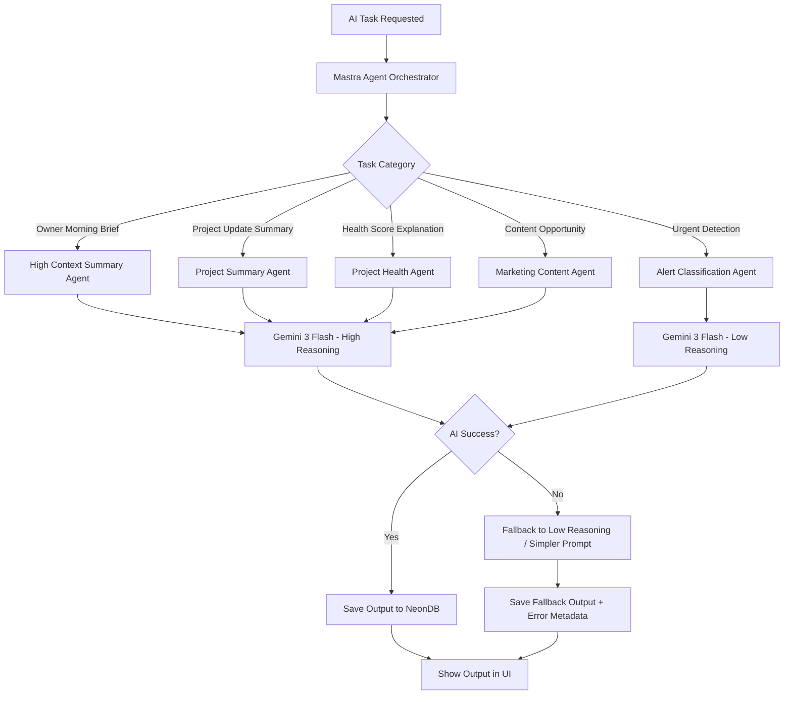

### AI Task Priority

```txt
P0 - Owner Morning Brief
P0 - Urgent Alert Detection
P1 - Daily Project Summary
P1 - Project Health Explanation
P2 - Content Opportunity Suggestion
P2 - Sales Lead Summary
```

### Model Routing Rule

```txt
Use Gemini 3 Flash high reasoning for:
- Owner dashboard summary
- Cross-project analysis
- Recommended owner actions
- Project health explanation
- Content opportunity with strategy angle

Use Gemini 3 Flash low reasoning for:
- Urgent keyword detection
- Simple classification
- Status normalization
- Short daily update summary
- Fallback when high reasoning fails
```

---

## 13. AI Summary Flow

Flow bagaimana AI membaca data dan menghasilkan summary, alert, dan rekomendasi action.

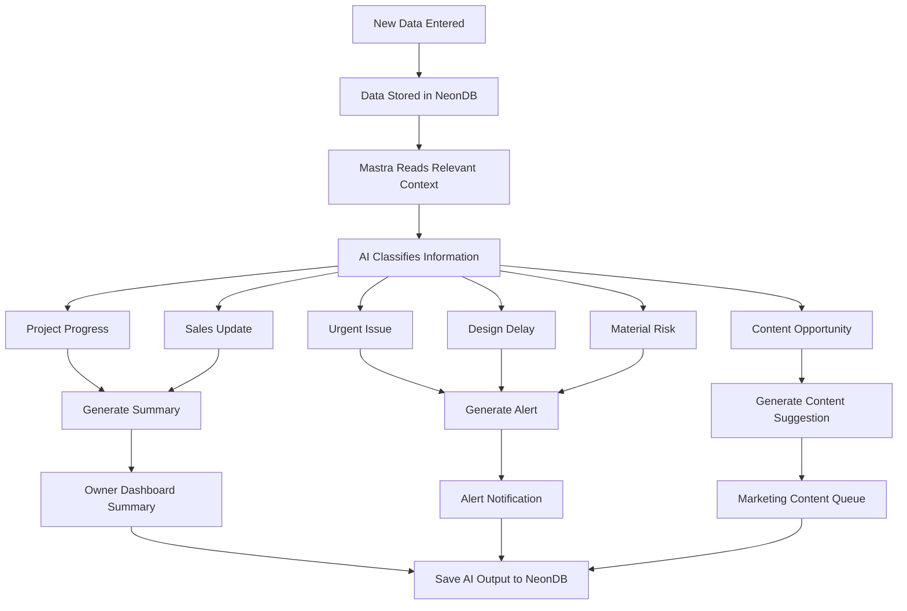

### MVP AI Capability

Untuk MVP, AI tidak perlu langsung terlalu otomatis. Cukup mulai dari kemampuan berikut:

```txt
- Summarize latest project updates
- Detect urgent keywords
- List delayed projects
- Suggest owner action
- Identify project ready for content
- Explain project health status
- Suggest simple content angle from available visual assets
```

### Example Urgent Keywords

```txt
delay
belum datang
revisi
client belum approve
material kosong
vendor telat
install mundur
ded belum selesai
butuh keputusan owner
approval tertahan
site belum update
progress stuck
```

---

## 14. Project Health Score Flow

Flow untuk menentukan status kesehatan project.

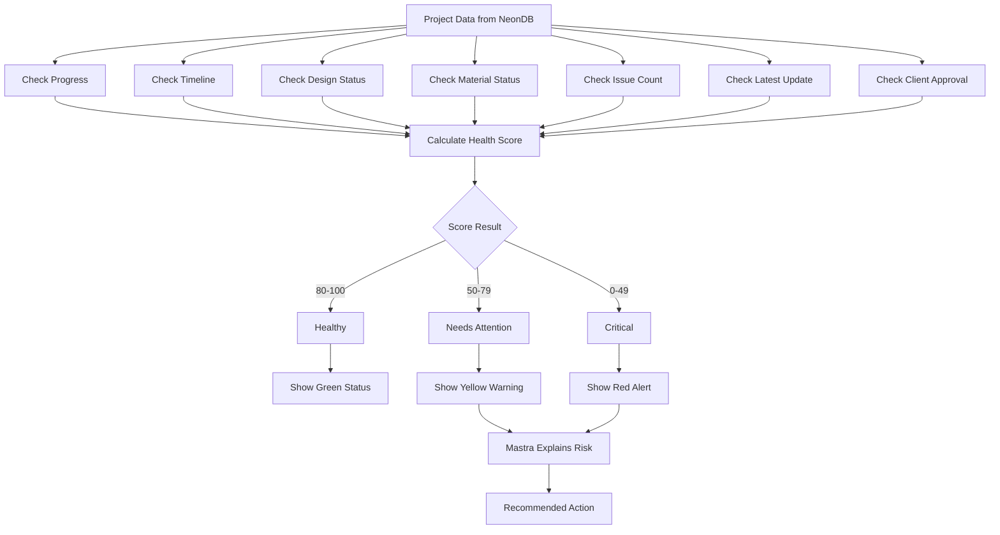

### Example Scoring Logic MVP

```txt
Start from 100 points.

- No update for more than 3 days: -20
- Material delayed: -20
- Design not approved after target date: -20
- Has urgent issue: -25
- Progress behind schedule: -30
- Client approval pending: -10
- DED not completed after design approval: -15

Final:
80-100 = Healthy
50-79 = Needs Attention
0-49 = Critical
```

---

## 15. Notification / Alert Flow

Flow untuk membuat alert otomatis berdasarkan event penting.

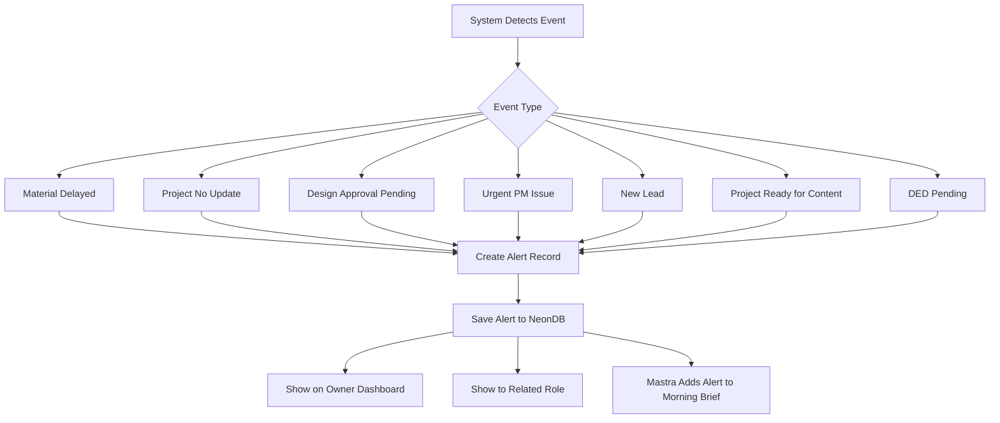

### Recommended Alert Types

```txt
Project Delay
No Daily Update
Material Delay
Design Pending
DED Pending
Urgent Issue
Lead Needs Follow Up
Content Opportunity
Client Approval Pending
Production Risk
Installation Risk
```

---

## 16. Updated Database Entity Relationship Flow

Gambaran awal entity utama untuk NeonDB / PostgreSQL.

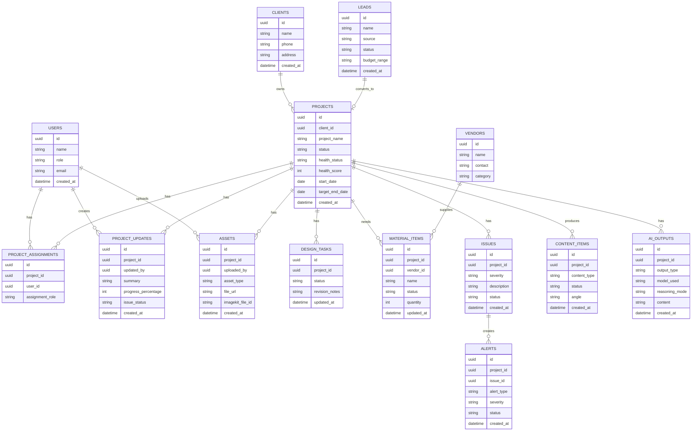

---

## 17. MVP Development Flow

Flow development dari PRD sampai internal launch, disesuaikan dengan stack terbaru.

```mermaid
flowchart TD
    A[PRD Completed] --> B[Create Flows]
    B --> C[Create MVP System Blueprint]
    C --> D[Create Data Model]
    D --> E[Create Wireframe]
    E --> F[Create Design System]
    F --> G[Create Technical Architecture]

    G --> H[Setup Project Repository]
    H --> I[Setup NeonDB]
    I --> J[Setup ImageKit]
    J --> K[Setup Auth & Role Access]
    K --> L[Setup Mastra AI Layer]
    L --> M[Setup Gemini Model Routing]

    M --> N[Build Owner Dashboard]
    N --> O[Build Project Module]
    O --> P[Build Daily Update Module]
    P --> Q[Build Asset Upload Module]
    Q --> R[Build Design / DED Module]
    R --> S[Build Material Module]
    S --> T[Build Sales / Leads Module]
    T --> U[Build Content Readiness Module]

    U --> V[Build AI Summary MVP]
    V --> W[Build Alert & Health Score]
    W --> X[Internal Testing]
    X --> Y[Fix Bugs]
    Y --> Z[Deploy MVP]
    Z --> AA[Team Training]
    AA --> AB[Collect Feedback]
    AB --> AC[Plan V2]
```

---

## 18. Updated Recommended Documentation Structure

Struktur dokumentasi yang disarankan untuk project besar ini.

```txt
/docs
  /01-prd
    prd.md

  /02-flows
    flows.md

  /03-blueprint
    mvp-system-blueprint.md

  /04-data
    database-schema.md
    entity-relationship.md
    status-enums.md
    seed-data.md

  /05-ui-ux
    wireframe-owner-dashboard.md
    wireframe-project-detail.md
    wireframe-daily-update.md
    wireframe-mobile-view.md
    design-system.md

  /06-technical
    tech-architecture.md
    api-routes.md
    authentication-role-access.md
    neon-db-architecture.md
    imagekit-storage-architecture.md
    ai-agent-architecture.md
    mastra-agent-plan.md
    gemini-model-routing.md

  /07-development
    development-roadmap.md
    sprint-plan.md
    task-breakdown.md
    ai-coding-agent-instructions.md
```

---

## 19. Development Priority Flow

Urutan development yang paling masuk akal untuk MVP setelah update stack.

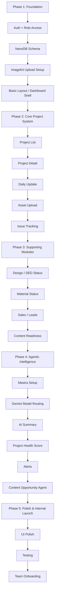

---

## 20. MVP Scope Recommendation

### Must Have

```txt
1. Login & role access
2. Owner dashboard
3. Project list
4. Project detail
5. Daily update PM
6. ImageKit upload for project photos/render/DED
7. NeonDB relational data structure
8. Design / DED status
9. Material status
10. Sales / leads snapshot
11. Content readiness status
12. Mastra AI summary simple
13. Urgent alerts
```

### Should Have

```txt
1. Project health score
2. AI recommended owner action
3. Filter project by status
4. Search project/client
5. Timeline activity
6. Basic notification
7. Content opportunity suggestion
8. Asset gallery per project
```

### Later

```txt
1. Finance deep tracking
2. Budget vs actual
3. Vendor performance
4. Advanced analytics
5. WhatsApp integration
6. Mobile app
7. Client portal
8. Full AI agent automation
9. Approval workflow with client-facing link
10. Advanced permission system
```

---

## 21. Most Important Flow to Build First

Flow inti yang sebaiknya dibangun paling awal agar sistem langsung terasa berguna.

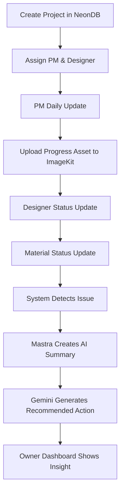

### Core Principle

```txt
Tim update data → asset tersimpan rapi → sistem membaca konteks → AI membuat insight → owner mengambil keputusan.
```

Kalau flow ini selesai dulu, sistem sudah punya value utama walaupun modul lain belum sempurna.

---

## 22. Next Recommended Documents

Setelah dokumen flow ini, dokumen berikutnya yang perlu dibuat atau disesuaikan adalah:

```txt
1. database-schema.md
2. status-enums.md
3. tech-architecture.md
4. neon-db-architecture.md
5. imagekit-storage-architecture.md
6. ai-agent-architecture.md
7. mastra-agent-plan.md
8. gemini-model-routing.md
9. api-routes.md
10. sprint-plan.md
11. task-breakdown.md
12. ai-coding-agent-instructions.md
```

---

## 23. Priority Summary

Flow paling penting untuk dijadikan dasar development awal:

```txt
1. Updated High-Level Architecture Flow
2. Project Lifecycle Flow
3. Daily Project Update Flow
4. Asset Upload & Storage Flow
5. Owner Morning Dashboard Flow
6. AI Agent Flow - Mastra + Gemini
7. AI Summary Flow
8. Project Health Score Flow
9. Database Entity Relationship Flow
10. MVP Development Flow
```

Dokumen ini bisa digunakan sebagai bridge antara PRD, MVP System Blueprint, dan technical planning.
